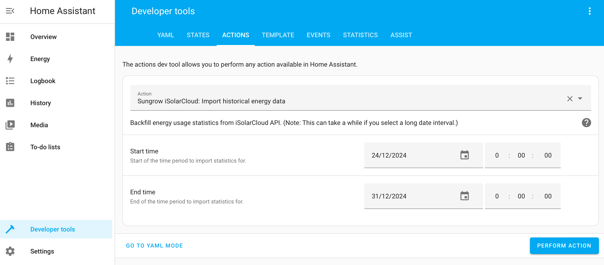

# iSolarCloud integration for HomeAssistant

This integration retrieves data from the [iSolarCloud API](https://developer-api.isolarcloud.com/) provided by Sungrow.

Integration is based on the [pysolarcloud](https://github.com/bugjam/pysolarcloud) library.

## Status
This integration is quite new and might still have bugs. It runs on my HomeAssistant installation but it is not a "proven" product yet.

The iSolarCloud API itself is also new and does not seem very mature. Their OAuth2 implementation required some workarounds as explained [below](#oauth2-flow).

## Sensors

The integration will add one device to your HomeAssistant, representing your Sungrow plant. The following sensors are added to the device:

### Energy sensors (in Wh)
* Battery charge energy
* Battery dischange energy
* Consumed energy
* Purchased energy
* Feed-in energy
* Produced energy
* Direct consumption

The energy sensors can be used in HomeAssistant's [Energy Dashboard](https://www.home-assistant.io/docs/energy/).

### Battery sensor (in %)
* Battery level

### Power sensors (in W)
* Load power
* Power flow (This is not explained well in the Sungrow documentation. It seems like it is the net power through the inverter, ie. current solar production +/- battery (dis)charge)

It's possible that other plant types offer different data points which may require changes to the integration. The current configuration is based on my own SH8.0RT-V112 plant.

## Configuration

1. Create an account in the [Sungrow Developer Portal](https://developer-api.isolarcloud.com/)
2. Create a new app
3. Enable the "Authorize with OAuth2.0" setting and enter this Redirect URI: `https://bounce.e-dreams.dk/isolarcloud/` (See explanation below)
4. Wait for Sungrow to approve your app
5. When the app is approved, you can find the needed configuration details in the devloper portal

## Installation

The integration can be installed with [HACS](https://hacs.xyz):

1. Add `https://github.com/bugjam/hass-isolarcloud` as a user defined repository in HACS
2. Install *iSolarCloud* from the HACS store
3. Restart HomeAssistant
4. Install *iSolarCloud* in HomeAssistant: Settings -> Integrations -> Add integration
5. Select your iSolarCloud server
6. The integrations uses HomeAssistant's [Application Credentials](https://www.home-assistant.io/integrations/application_credentials/) integration to manage the OAuth2 configuration. You will be prompted to enter *Client Id* and *Client Secret*
   * *Client Id* must contain two values from the Sungrow developer portal: *ApplicationId* and *Appkey*, separated by a `@`. Example: `499@586FEE69FC005B17361AB992FC5B1CEA`
   * *Client Secret* is the *Secret Key*
7. HomeAssistant will show a button to navigate to iSolarCloud
8. Log in and select the plant you want to fetch data for
9. You will be redirected back to [My Home Assistant](https://www.home-assistant.io/integrations/my/)

## OAuth2 flow

The iSolarCloud API supports OAuth2 but unfortunately does not quite follow the standard: The server is expected to 
return the `state` parameter to HomeAssistant when authorisation is completed but this parameter is missing.
To overcome this, I have added a script on my own server which temporarily stores the `state` in a cookie
and adds the missing parameter back to the request.
The script can be found here: [https://github.com/bugjam/hass-isolarcloud/blob/main/bounce/index.php].

(The script does not store your authorisation code. And even if I could get hold of it, I could use it without
knowing your appkey and secret key.)

## Importing historical data

The integration can fetch energy data from iSolarCloud to make statistics available in HomeAssistant, e.g. from before the integration was installed or in case your HomeAssistant has been offline.

Data will be imported in 1-hour intervals. Import is available for data before today's date.

The import can be initiated from [Developer Tools](https://my.home-assistant.io/redirect/developer_services/):

*Note:* Imported data may appear to be 1 hour off in the Energy Dashboard, e.g. the energy consumed between 09:00 and 10:00 appears in the "10:00-11:00" column in the dashboard. This is because HomeAssistant attributes the value for 10:00 to the 10:00-11:00 in the visual presentation, even though the energy was really used in the previous hour. The underlying data is stored correctly, it's just the visualization which is off.